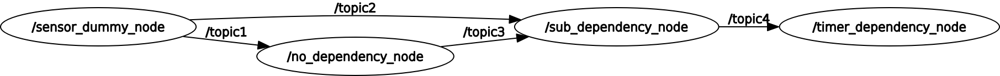

# e2e_demo

## rqt_graph
Here is a result of 'rqt_graph'


## Setup

### Install LTTng

See [micro-ROS tutorial](https://micro-ros.github.io/docs/tutorials/advanced/tracing/).

### build forked-foxy

```
mkdir -p ~/ros2_foxy_fork/src
cd ~/ros2_foxy_fork

wget https://raw.githubusercontent.com/ros2/ros2/foxy/ros2.repos
vcs import src < ros2.repos

cd src/ros-tracing/ros2_tracing
git remote add forked https://gitlab.com/HasegawaAtsushi/ros2_tracing
git pull forked
git checkout -b devel_e2e_measurement forked/devel_e2e_measurement

cd ~/ros2_foxy_fork/src/ros2/rclcpp
git remote add forked https://github.com/hsgwa/rclcpp.git
git pull forked
git checkout -b devel_e2e_measurement forked/devel_e2e_measurement

cd ~/ros2_foxy_fork/
colcon build --symlink-install
```


### build demo program and tracetools_analysis

```
mkdir -p ~/ros2_trace_test/src

cd ~/ros2_trace_test/src
git clone https://gitlab.com/HasegawaAtsushi/tracetools_analysis.git -b devel_e2e_measurement

cd ~/ros2_trace_test/src
git clone https://github.com/hsgwa/e2e_demo.git

cd ~/ros2_trace_test
source ~/ros2_foxy_fork/install/setup.bash
colcon build --symlink-install
```

## Usage

### run demo program
```
source ~/ros2_foxy_fork/install/setup.bash
source ~/ros2_trace_test/install/local_setup.bash

ros2 launch e2e_demo demo.launch.py
# send Ctrl+C after few seconds later
# trace data is recorded at ~/.ros/tracing/e2e_demo
```

### visualize with jupyter
```
cd src/e2e_demo/analysis/
jupyter-lab
```

see these samples below.

- comm_latency.ipynb
- create_architecture_template.ipynb
- e2e_latency.ipynb
- flame_graph.ipynb
- node_latency.ipynb

## Setup callback dependency
To calculate node latency, this scripts uses architecture.json to recognize callback dependency.
This section describes how to setup callback dependency.

### create template file
A template file can be generated from trace data.
see 'analysis/create_architecture_template.inpynb' to generate architecture.json.template

### write callback dependency
Edit architecture.json.template and save as architecute.json.
Add subsequent callback symbol to "subsequent_callback_symbols".

---


## architecture.json のフォーマット

// 以降をコメントとしてお読みください。　
コメントの先頭に ※ がある項目が手動での変更が必要になる項目です。

```json


{
  "nodes": [ 
    {
      "name": "callback name [string]",   // コールバック名[string]
      "namespace": "name space [string]", // ノードの名前空間[string]
      "start_node": true / false [bool],  // ※ End-to-End の開始ノードフラグ
      "end_node": true / false [bool],    // ※ End-to-End の終了ノードフラグ
      "callbacks": [
        {
          "type": "timer_callback [string]",         // コールバックの種類（timer コールバックの場合）
          "period": 100 [float],                     // タイマーコールバックの周期
          "symbol": "timer_callback_symbol [string], // コールバックのシンボル名
          "publish_topic_names": [                   // コールバックが publish するトピックのリスト
            "/topic_name" [string],                  // ※ トピック名
		  ]
          "subsequent_callback_symbols": [           // ノード内で後続するコールバックのリスト
		                                             // 後続するコールバックのシンボル名をコピーする。
            "subscribe_callback_symbol" [string],    // ※ コールバックのシンボル名
			                                         // 例では、timer -> subscribe の依存を記述しています。
		  ],
        },
        {
          "type": "subscribe_callback [string]", // コールバックの種類（subscribe コールバックの場合）
          "topic_name": "topic name [string]",   // subscribe するトピック名
          "symbol": "subscribe_callback_symbol [string]",      // コールバックのシンボル名
          "publish_topic_names": [               // コールバックが publish するトピックのリスト
            "/topic_name" [string],              // ※ トピック名
		  ],
          "subsequent_callback_symbols": [       // ノード内で後続するコールバックのリスト
                                                 // ※ コールバックのシンボル名
		  ],
        }
      ],
      "unlinked_publish_topic_names": [ // ノードがpublishするトピック名のリスト。
	                                    // 対応するコールバックが不明なもの。
        "/topic_name [string]"          // ※ トピック名。 対応するコールバックの"publish_topic_names"に移す。
      ]
    }
  ]
}
```


## テンプレートの修正

テンプレートでは、コールバックの依存関係など一部の記述がされていません。
それらの項目は手動での修正が必要になります。

## End-to-End の始点と終点を設定
1. 始点となるノードの "start_node" を true に変更します。
2. 終点となるノードの "end_node" を true に変更します。

### コールバック関数とpublishするトピック名の紐付け

1. 出力したテンプレート内の "unlinked_publish_topic_names" には、どのコールバックが publish しているか不明なトピック名が列挙されます。
2. "unlinked_publish_topic_names" に列挙されたトピック名を、対応するコールバックの"publish_topic_names"に移します。
3. "unlinked_publish_topic_names" が空になるまで行ってください。  


### コールバック関数間の依存関係の記述

1. ノード内にコールバック間の依存関係が存在する場合、
   "subsequent_callback_symbols"に後続するコールバックのシンボル名を記述します。
   シンボル名は "symbol" からコピーしてください。
2. 各ノード内でコールバック依存関係を記述してください。


## パスの確認

記述したパスが正しいことを確認します。
analysis/path_check.ipynb を参考に、両ファイルを読み込んでください。

### ノード間の依存関係の確認

```python
for path in app.paths:
    print()
    print(path.child_names)
```

ノード間のパスが以下のように出力されます。
ノード名が「--」で連結された形で出力されます。

```
sensor_dummy_node--no_dependency_node--sub_dependency_node--timer_dependency_node--actuator_dummy_node

sensor_dummy_node--no_dependency_node--sub_dependency_node--actuator_dummy_node

sensor_dummy_node--sub_dependency_node--actuator_dummy_node
```

### コールバック間の依存関係の確認

```python
for node in app.nodes:
    print()
    print(node.name)
    for path in node.paths:
        print(path.child_names)
```
ノード内のパスが以下のように出力されます。
コールバックのシンボル名が「--」で連結された形で出力されます。

```

timer_dependency_node
TimerDependencyNode::TimerDependencyNode()::{lambda()#2}
TimerDependencyNode::TimerDependencyNode()::{lambda(std::unique_ptr<sensor_msgs::msg::Image>)#1}--TimerDependencyNode::TimerDependencyNode()::{lambda()#2}

no_dependency_node
NoDependencyNode::NoDependencyNode()::{lambda(std::unique_ptr<sensor_msgs::msg::Image>)#1}

actuator_dummy_node
ActuatorDummy::ActuatorDummy()::{lambda(std::unique_ptr<sensor_msgs::msg::Image>)#1}
ActuatorDummy::ActuatorDummy()::{lambda(std::unique_ptr<sensor_msgs::msg::Image>)#2}

sub_dependency_node
SubDependencyNode::SubDependencyNode()::{lambda(std::unique_ptr<sensor_msgs::msg::Image>)#1}
SubDependencyNode::SubDependencyNode()::{lambda(std::unique_ptr<sensor_msgs::msg::Image>)#1}--SubDependencyNode::SubDependencyNode()::{lambda(std::unique_ptr<sensor_msgs::msg::Image>)#2}
SubDependencyNode::SubDependencyNode()::{lambda(std::unique_ptr<sensor_msgs::msg::Image>)#2}

sensor_dummy_node
SensorDummy::SensorDummy()::{lambda()#1}
SensorDummy::SensorDummy()::{lambda()#2}
```