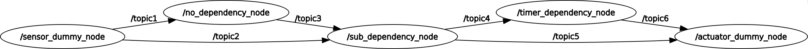

# e2e_demo

## rqt_graph
Here is a result of 'rqt_graph'



## Usage
### Run application

1. Add Trace() to your  launch file

   ```
   from tracetools_launch.action import Trace
   
   def generate_launch_description():
       return launch.LaunchDescription([
           Trace(
               session_name='e2e_demo',
               events_kernel=[]
           ),
           ...]
   ```

2. Build application

   ```
   $ source ~/ros2_foxy_fork/install/setup.bash
   $ colcon build --symlink-install
   ```

3. Run

   ```
   $ ros2 launch your_package launch.py
   ```

### Analyze application

1. Copy analysis directory to your application
2. Prepare architecture.json (Only once)
   1. Create_architecture_template.ipynb
   2. Modify architecture.json.template and save to architecture.json
   3. Check architecture.json with `path_check.ipynb`
3. Visualize results
   - `e2e_latency.ipynb` : end-to-end latency
   - `node_latency.ipynb`: node latency and callback duration latency
   - `comm_latency.ipynb`: communication latency
   - `flame_graph.ipynb` : End-to-end, communication, node, and callback latency

